# FGL-GH-24: Embedded Telemetry & Automated Observability Platform


An industrial-grade IoT telemetry and environmental monitoring system bridging physical embedded microcontroller hardware with modern Linux container infrastructure and real-time observability pipelines.

---

## 1. System Architecture

```mermaid
graph LR
    subgraph EdgeHardware ["Physical Edge Hardware"]
        SENSORS["Environmental Sensors<br/>(DHT22, Soil, Light, DS18B20)"] --> MCU["Embedded Microcontroller<br/>(AVR / C++ Firmware)"]
        MCU --> W5100["W5100 Ethernet Controller<br/>(SPI Bus Interface)"]
    end

    subgraph NetworkLink ["Transport Layer"]
        W5100 -->|"Direct Ethernet Link (10/100 Mbps)<br/>Subnet: 10.0.0.0/24"| ETH["Linux Host Interface<br/>(enp0s25 / Static IP)"]
    end

    subgraph LinuxHost ["Host Observability Stack (Docker Compose)"]
        ETH --> NGINX["Nginx Edge Ingress Proxy<br/>(:8080)"]
        NGINX --> JSON_EXP["Prometheus JSON Exporter<br/>(:7979)"]
        JSON_EXP --> PROM["Prometheus Time-Series TSDB<br/>(Scrape Interval: 15s)"]
        PROM --> GRAFANA["Grafana Analytics & Dashboards<br/>(:3000)"]
    end
```



---

## 2. Key Engineering Highlights

* **Bare-Metal Hardware & Firmware:**
  * Embedded C++ firmware built with optimized memory footprint using `avr-libc` and `PROGMEM` flash storage for static web assets.
  * Hardware communication via SPI interface to a dedicated W5100 hardware TCP/IP controller.
  * Fault-tolerant serial monitoring and telemetry streaming (`/dev/ttyUSB0` at 9600 baud).

* **Deterministic Networking:**
  * Direct crossover Ethernet interconnect between edge controllers and host processing nodes (`10.0.0.0/24`).
  * Dedicated low-latency packet transit isolated from public gateway networks.

* **Cloud-Native Observability Pipeline:**
  * Fully declarative `docker-compose` orchestration with isolated internal bridge networks and non-root security contexts (`UID: 65534`).
  * End-to-end telemetry ingestion using `prometheuscommunity/json-exporter` to transform raw microcontroller sensor payloads into Prometheus metric format.
  * Persistent Grafana visualization and Prometheus TSDB storage with WAL integrity.

* **Automated CI/CD & Documentation:**
  * Integrated `.gitlab-ci.yml` pipeline automating Doxygen API documentation generation and build validation.

---

## 3. Quick Start & Deployment

### Hardware Network Setup
Establish the direct link interface on the host machine:
```bash
sudo ip addr add 10.0.0.1/24 brd + dev enp0s25
sudo ip link set enp0s25 up
```

### Serial Diagnostics
To access the real-time hardware telemetry feed:
```bash
stty -F /dev/ttyUSB0 raw 9600 && cat /dev/ttyUSB0
```

### Starting the Observability Stack
```bash
# Clone the repository
git clone https://github.com/annadostoevskaya/greenhouse.git
cd greenhouse

# Launch the containerized monitoring stack
docker compose up -d

# Verify services
docker compose ps
```

* **Web Ingress:** `http://localhost:8080`
* **Prometheus Targets:** `http://localhost:9090`
* **Grafana Dashboard:** `http://localhost:3000` (Default: `admin` / `admin`)

---

## 4. Repository Structure

```text
├── firmware/              # Microcontroller C++ source code & hardware drivers
├── docker/
│   ├── json-exporter.yml  # Metric extraction patterns for sensor JSON
│   └── prometheus.yml     # Scrape targets and TSDB retention configurations
├── docker-compose.yml     # Multi-container orchestration (Nginx, Prometheus, Grafana)
├── deploy.sh              # Host automation deployment script
├── stress.sh              # Network throughput & telemetry load testing utility
└── .gitlab-ci.yml         # Automated CI/CD pipeline definition
```

---

## 5. License & Compliance
This project is open-source software licensed under the MIT License. It represents independent hardware/software research and development.
